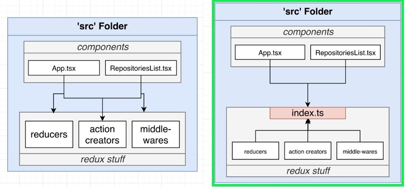
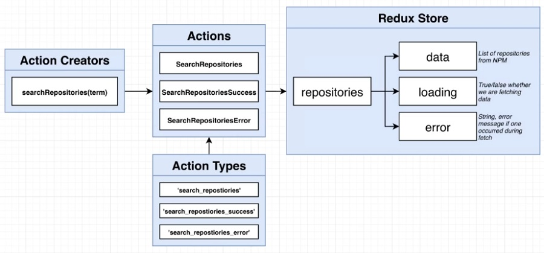

npm i --save-exact @types/react-redux@7.1.15 axios@0.21.1 react-redux@7.2.2 redux@4.0.5 redux-thunk@2.3.0

# Redux TS - Redux project

## Think about Design First

 <!-- registry.npmjs.org/-/v1/search?text=react -->

<details>
<summary>Redux design</summary>
<details>
<summary>
Redux Store
</summary>

```js
// Repositories :
// => data : list of repositories from NPM
// => loading : true/false whether we are fetching data
// => error : string, error message if one occurred during fetch
```



</details>

<details>
<summary>Actions</summary>

```js
// Action Creators:
// => searchRepositories(term)

// Actions:
// => SearchRepositories
// => SearchRepositoriesSuccess
// => SearchRepositoriesError

// Actions Types:
// => 'search_repositories'
// => 'search_repositories'
// => 'search_repositories_success'
// => 'search_repositories_error'
```



</details>

<details>
<summary>Redux - Ts Issues to avoid </summary>

```js
// Import can turn messy quickly
// Communacating types to components can be challenging
// Type def files can be over-engineered
```

</details>

</details>
